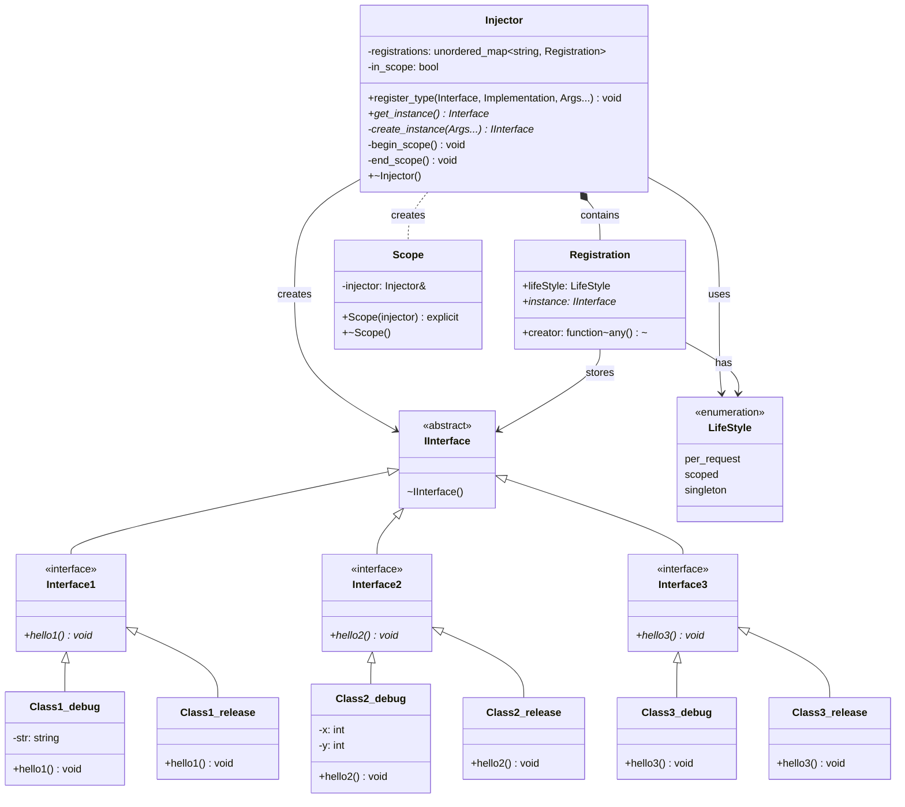

```mermaid

classDiagram
    direction TB

    class IInterface {
        <<abstract>>
        ~IInterface()
    }

    class Injector {
        -registrations: unordered_map~string, Registration~
        -in_scope: bool
        +register_type(Interface, Implementation, Args...) void
        +get_instance() Interface*
        -create_instance(Args...) IInterface*
        -begin_scope() void
        -end_scope() void
        +~Injector()
    }

    class Registration {
        +creator: function~any()~
        +lifeStyle: LifeStyle
        +instance: IInterface*
    }

    class LifeStyle {
        <<enumeration>>
        per_request
        scoped
        singleton
    }

    class Scope {
        -injector: Injector&
        +Scope(injector) explicit
        +~Scope()
    }

    class Interface1 {
        <<interface>>
        +hello1()* void
    }

    class Interface2 {
        <<interface>>
        +hello2()* void
    }

    class Interface3 {
        <<interface>>
        +hello3()* void
    }

    class Class1_debug {
        -str: string
        +hello1() void
    }

    class Class1_release {
        +hello1() void
    }

    class Class2_debug {
        -x: int
        -y: int
        +hello2() void
    }

    class Class2_release {
        +hello2() void
    }

    class Class3_debug {
        +hello3() void
    }

    class Class3_release {
        +hello3() void
    }

    %% Наследование
    IInterface <|-- Interface1
    IInterface <|-- Interface2
    IInterface <|-- Interface3
    
    Interface1 <|-- Class1_debug
    Interface1 <|-- Class1_release
    Interface2 <|-- Class2_debug
    Interface2 <|-- Class2_release
    Interface3 <|-- Class3_debug
    Interface3 <|-- Class3_release

    %% Композиция и ассоциации
    Injector *-- Registration : contains
    Injector --> LifeStyle : uses
    Injector --> IInterface : creates
    Registration --> LifeStyle : has
    Registration --> IInterface : stores
    Injector .. Scope : creates

```