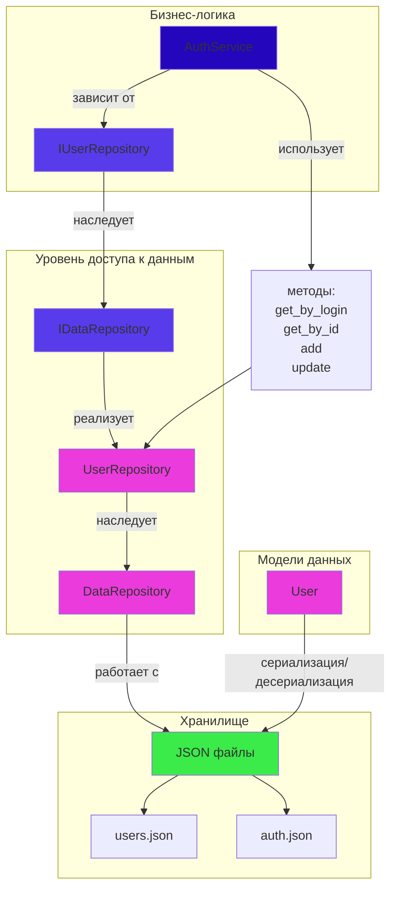

## Наиболее вероятные вопросы: 
1. "Объясни паттерн Repository и как он реализован в твоей работе?"

Repository — это паттерн, который абстрагирует доступ к данным, предоставляя единый интерфейс для работы с сущностями, независимо от способа их хранения.

### **1. `IDataRepository<T>`** 
```cpp
// Универсальный контракт: "Любой репозиторий должен уметь:"
// - get_all(), get_by_id(), add(), update(), del()
// Для ЛЮБОГО типа данных T
```

### **2. `DataRepository<T>`**
```cpp
// Конкретная реализация: "Я реализую этот контракт через JSON файлы"
// Работает для User, Product, Order - любого T
```

### **3. `IUserRepository`** 
```cpp
// Специфичный контракт: "Репо для User должен дополнительно уметь:"
// - get_by_login() // специфичный метод для пользователей
```

### **4. `UserRepository`**
```cpp
// Финальная реализация: "Я реализую ВСЕ контракты для User:"
// - От IDataRepository: CRUD операции (через DataRepository<User>)  
// - От IUserRepository: get_by_login() (своя реализация)
// Конкретно для типа User через JSON хранилище
```


## Итоговая схема:
```
IDataRepository<T> (общий контракт)
          ↑
DataRepository<T> (JSON реализация для любого T)
          ↑
DataRepository<User> (специализация для User)
          ↑
UserRepository + IUserRepository (финальная реализация + специфичные методы)
```

**Ты полностью правильно понял иерархию и разделение ответственности!** 🎯


3. "Как достигается абстракция доступа к данным в твоей реализации?"

Бизнес-логика не зависит от формата хранения
AuthService НЕ знает:

❌ Что данные в JSON формате

❌ Какие файлы используются

❌ Как парсится JSON

❌ Как обрабатываются ошибки файлов

❌ Как кэшируются данные

AuthService знает только:

✅ Какой пользователь нужен (по логину)

✅ Что делать при успешной авторизации


---


