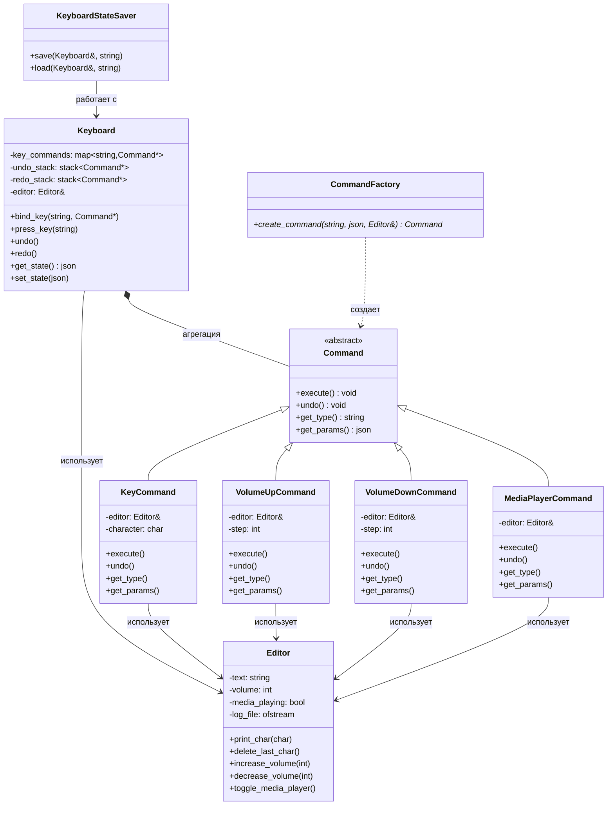

## Command

Command — это поведенческий паттерн проектирования, который инкапсулирует запрос в виде объекта, позволяя параметризовать клиенты с различными запросами, организовывать очередь запросов или поддерживать отмену операций

**Паттерн Command** — это когда каждая операция (действие) становится отдельным объектом.

## Простая аналогия:
Представь, что команда — это кнопка на пульте:
- **Кнопка** — это объект команды
- **Телевизор** — это объект, который выполняет действие
- **Ты** — это тот, кто нажимает кнопку

## В этой программе:

**Команды** — это разные действия:
- `Напечатать букву 'а'`
- `Увеличить громкость` 
- `Включить/выключить плеер`

**Клавиатура** — это пульт, где:
- Клавишам назначены команды
- Есть кнопки **Отмена** и **Повтор**

**Редактор** — это телевизор, который реально выполняет действия

## Главная фишка:
Клавиатура не знает, КАК выполнять команды, она только знает, КОГДА их выполнять. А команды сами знают, что делать.

# Что делают классы
1. Editor (Редактор) - Реальный исполнитель всех действий
2. Command (Команда) - абстрактный класс.Определяет интерфейс для всех команд
3. Конкретные команды:
    * KeyCommand - Печатает символ в редакторе
    * VolumeUpCommand - Увеличивает громкость
    * VolumeDownCommand - Уменьшает громкость
    * MediaPlayerCommand - Включает/выключает медиаплеер
4. Keyboard (Клавиатура) - Управляет командами и горячими клавишами
5. CommandFactory (Фабрика команд) - Создает команды по типу и параметрам
6. KeyboardStateSaver (Сохранение состояния) - Сохраняет и загружает привязки клавиш

---

Основные связи:

Command - абстрактный базовый класс для всех команд

Конкретные команды наследуются от Command и работают с Editor

Keyboard хранит команды в map и управляет стеками undo/redo

CommandFactory создает команды по типу и параметрам

KeyboardStateSaver сохраняет/загружает состояние привязок клавиш

---

